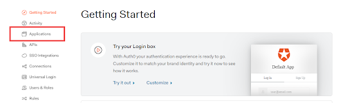
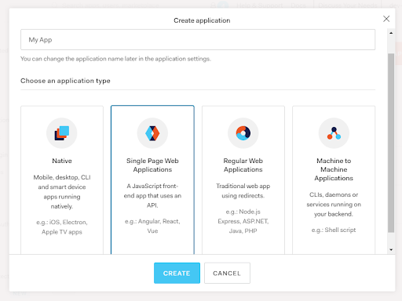
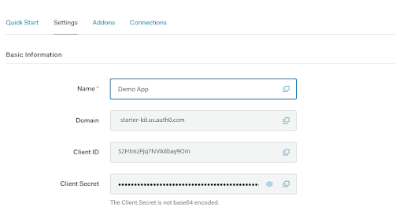
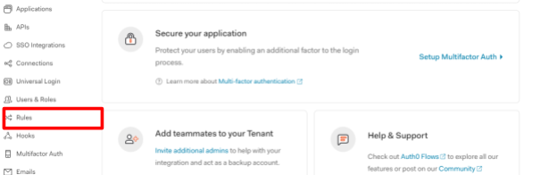
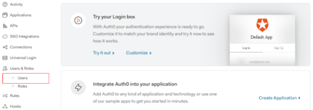
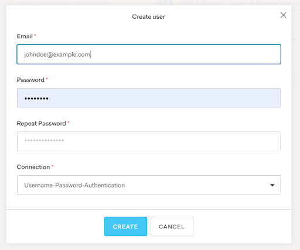

# Setup Project saas-starter

### With clap

`clap example saas-starter my-app`

### Change Directory
`cd my-app`

### Start the Dev server
`npm start`

### Start the Prod server for final deployment
`npm install -g serve`
`npm run build`
`serve -s build`
Code is now running on port 3000.

### Auth0 Setup for Hasura backend.
This guide will help you set up and connect Auth0 to Hasura GraphQL Engine running on a docker container.  Visit https://auth0.com/ and signup for an auth0 account which will be used throughout this guide. Once you have created your account you can follow the steps below to connect your newly created auth0 account to Hasura GraphQL Engine.

### Auth0 Application.
The following steps will help you set up an auth0 application, get the auth0 domain, and the client id needed to enable auth0 login in the client app. This guide assumes you are using React JS on the client.

1- Login to your auth0 account to access your https://manage.auth0.com/dashboard dashboard.

2- Click on the Applications menu on the left. 
3- From the Create Application window enter a name and select Single Page Web Applications and click create.

4- Once the application has been successfully created you will be greeted with the details of the application that was just created and quickstart guides. 
5- Go to the settings tab of the application details page to view the Client ID and the Domain Name for your application. 
  
6- Add the client id and domain in src/auth_config.json file.

### Configuring Rules and Callbacks.
**Callback URLs:**

    1- In the application settings page scroll down to the Application URIs section and set appropriate URLs as Allowed Callback URLs and Allowed Web Origins. Add domain-specific URLs as well for production apps (e.g: https://myapp.com/callback). 
    2- Assuming that your react application is running on port 3000 these should be set to something like http://localhost:3000/callback.

**Rules:**

Auth0 rules have to be added to allow clients to authenticate users and add Hasura claims to their tokens. Follow the steps below to add auth0 rules.

1- From the options on the left-hand side select rules.
      
2- Click on the  Create Rule button to the top left. 
3- Select Empty Rule. 
4- Set a new name for the rule. 
5- Paste the following code in the Script section 

function (user, context, callback) { 
  const namespace = "https://hasura.io/jwt/claims"; 
  context.idToken[namespace] = 
    { 
      'x-hasura-default-role': 'user', 
      // do some custom logic to decide allowed roles 
      'x-hasura-allowed-roles': ['user'], 
      'x-hasura-user-id': user.user_id 
    }; 
  callback(null, user, context); 
} 

6- Click on Save Changes to add the rules to auth0.

### Adding a new user.
Auth0 provides database connections to authenticate users with an email/username and password. To add a new user follow the steps below.

1- Click on Users and Roles menu on the left side of the dashboard and click on the Users option from the sub menu.
    

2- Click on Create User and in the window that pops up enter the user credentials.
    

3- Make sure the Connection is set to Username-Password-Authentication.

### Configuring Services and Setting ENV variables.
**User Actions service Auth0 config.**

If you are using the Hasura user actions service for this example found on the backend services repository you will need  access to the Management API on auth0 to manage users. Follow the steps below to create a Machine to Machine application on Auth0 to generate the clientId and client secret needed by the user actions service to use the Management APIs.

    1- Go to the Auth0 dashboard and select Applications from the left hand menu.
    2- Click on the Create Application button to the top left.
    3- Set a name for the application and select Machine to Machine Applications from the list (4th option ).
    4- In the Authorize Machine to Machine applications window select Auth0 Management API.
    5- From the scopes, select the following scopes
        * read: users
        * update: users 
        * create: users
        * delete: users
        * update : users_app_metadata
        * read:client_grants
        * create:client_grants

In the settings page of the Machine to Machine application you will find your client id and client secret. Paste these along with the other required environment variables in the .env file. Use the .env.sample file as a reference.

Add password grant type using the following steps. 
    1- Click on the Show Advanced Settings button at the bottom of the application settings. 
    2- Click on the Grant Types tab. 
    2- Select Password check box. 
    4- Click on save settings button. 

# How do I create an S3 Bucket? #

Before you can upload data to Amazon S3, you must create a bucket in one of the AWS Regions to store your data. After you create a bucket, you can upload an unlimited number of data objects to the bucket.

The AWS account that creates the bucket owns it. By default, you can create up to 100 buckets in each of your AWS accounts. If you need additional buckets, you can increase your account bucket quota to a maximum of 1,000 buckets by submitting a service quota increase. For information about how to increase your bucket quota, see [AWS Service Quotas](https://docs.aws.amazon.com/general/latest/gr/aws_service_limits.html) in the AWS General Reference.

Buckets have configuration properties, including geographical Region, access settings for the objects in the bucket, and other metadata.

## To create a bucket ##

1. Sign in to the AWS Management Console and open the Amazon S3 console at https://console.aws.amazon.com/s3/.

2. Choose **Create bucket**.

3. In Bucket name, enter a DNS-compliant name for your bucket.
    The bucket name must:
    -  Be unique across all of Amazon S3.
    -  Be between 3 and 63 characters long.
    - Not contain uppercase characters.
    - Start with a lowercase letter or number.

    After you create the bucket, you can't change its name. For information about naming buckets, see [Rules for bucket naming](https://docs.aws.amazon.com/AmazonS3/latest/dev/BucketRestrictions.html#bucketnamingrules) in the Amazon Simple Storage Service Developer Guide.

    > :warning: Important
    Avoid including sensitive information, such as account numbers, in the bucket name. The bucket name is visible in the URLs that point to the objects in the bucket.

4. In **Region**, choose the AWS Region where you want the bucket to reside.
Choose a Region close to you to minimize latency and costs and address regulatory requirements. Objects stored in a Region never leave that Region unless you explicitly transfer them to another Region. For a list of Amazon S3 AWS Regions, see [AWS service endpoints](https://docs.aws.amazon.com/general/latest/gr/rande.html#s3_region) in the Amazon Web Services General Reference.

5. **In Bucket settings for Block Public Access**, choose the Block Public Access settings that you want to apply to the bucket.

    We recommend that you leave all settings enabled unless you know you need to turn one or more of them off for your use case, such as to host a public website. Block public access settings that you enable for the bucket will also be enabled for all access points that you create on the bucket. For more information about blocking public access, see [Using Amazon S3 Block Public Access](https://docs.aws.amazon.com/AmazonS3/latest/dev/access-control-block-public-access.html) in the Amazon Simple Storage Service Developer Guide.

6. (Optional) If you want to enable S3 Object Lock:

    a. Choose **Advanced settings**, and read the message that appears.
    > :warning: Important
You can only enable S3 Object Lock for a bucket when you create it. If you enable Object Lock for the bucket, you can't disable it later. Enabling Object Lock also enables versioning for the bucket. After you enable Object Lock for the bucket, you must configure the Object Lock settings before any objects in the bucket will be protected. For more information about configuring protection for objects, see [How do I lock an Amazon S3 object?](https://docs.aws.amazon.com/AmazonS3/latest/user-guide/object-lock.html).

    b. If you want to enable Object Lock, enter enable in the text box and choose **Confirm**.

    For more information about the S3 Object Lock feature, see Locking Objects Using Amazon S3 Object Lock in the Amazon Simple Storage Service Developer Guide.

7. Choose **Create bucket**.

## Services

### Image Manager Service.
Hasura doesn't provide a native API to handle file uploads. File uploads have to be handled using an external REST API which uploads the images to the desired location. The image manager service provides the REST API needed to upload the images to AWS S3 or some other compatible object storage service and returns the image location/URI on successful upload. 

### Authentication Service.
The authentication service provides a mechanism by which other services like the image manager will be able to authenticate requests made to those services. You can configure the authentication service with the public key used to validate and verify jwt tokens.

### User Actions Service.
The user actions service is used to modify data, such as the login credentials which is stored on Auth0, on behalf of Hasura. On successful modification of the data on Auth0 the user actions service makes the corresponding changes on the Hasura server as well.

### Setting ENV variables

The ENV variables for each service needs to be set before they can be started and used. The following section lists the env variables needed for each of the services. These variables can be set in the .env file for the corresponding service’s folder. Use the .env.sample file found in each service as a reference.

### User actions service ENV variables
The following env variables need to be set for the user-actions service. 

    1- DOMAIN=Your auth0 domain(Add with https Ex: http://<domain-name>).
    2- CLIENT_ID=The auth0 client id obtained after setup the machine to machine app.
    3- CLIENT_SECRET=The auth0 client secret obtained after setup the machine to machine app.
    4- TOKEN_AUDIENCE=<Auth-0 Domain URL>/api/v2/ (Click on API tab on left panel).
    5- TOKEN_GRANT_TYPE=client_credentials
    6- HASURA_SECRET=newcode
    7- HASURA_URL=Hasura base url(For local Ex: http://<system-ip>/v1/graphql).
    8- PASSWORD_GRANT_TYPE=password

### Image service ENV variables
The following env variables are required for the image service.  
    
    1- S3_ACCESS_KEY_ID=AWS S3 access key.
    2- S3_SECRET_ACCESS_KEY=AWS S3 secret.
    3- S3_ENDPOINT=AWS S3 endpoint
    4- S3_BUCKET=AWS S3 bucket to store the images.
    5- AUTH_SERVICE=Base url where the Authentication service is running.

### Authentication service ENV variables
    1- USE_AUTH0=true
    2- AUTH0_DOMAIN=Just the auth0 domain name and region. Ex “d4rg-a7ae.us”

### Hasura ENV variables
    1- HASURA_GRAPHQL_ADMIN_SECRET : The admin secret used to authenticate with Hasura as admin.
    2- HASURA_GRAPHQL_JWT_SECRET : The auth0 JWK or public key. This can be generated using https://hasura.io/jwt-config tool.

### Starting the services.

After cloning the repository and setting the environment variables the services can be started using the command “docker-compose up -d” command.

### Importing the database schema and metadata in Hasura.
**Database**

The database schema can be imported using the command "docker exec -i saaskit-pg  psql -U postgres -d database_name < schema_file".

After import the database, replace the Auth0 user_id and email(created by you) in following tables. 
    1- logged_in_user  
    2- user  
    3- user_role  

**Metadata**

To import the hasura metadata follow the steps below.

    1- Click on the settings button to the top right of the Hasura dashboard.
    2- Click on the import metadata button from the Hasura Metadata actions window.
    3- Select the metadata file(hasura_ssk_metadata.json).

**Configuring webhooks.**

Once the metadata file has been imported the actions section of hasura will be populated with necessary actions like changeEmail, changePassword, signup etc. For these to work properly you need to configure the location/address of these hooks. Follow the steps below to configure them.

    1- Click on the actions button in the header of the hasura console.
    2- In the Actions section on the left click on changePassword action.
    3- It should show the details of the changePassword action.
    4- Scroll down to the input field with the label Handler.
    5- Replace the url with <your-ip>:4710/change-password.
    6- Do the same for the remaining actions.

**Set the default directory.**

To set the default directory follow the steps below.

    1- Open the Auth0 dashboard.
    2- Click on dropdown(User Account) in the top right header.
    3- Click on settings.
    4- In the general tab, put the "Username-Password-Authentication" in Default Directory section.
    5- Click on save button.
    